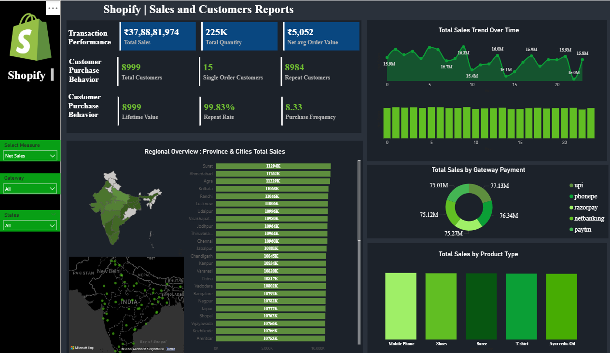

# 🛒 Shopify Sales Analysis

This project analyzes Shopify sales data using SQL and Power BI to uncover key business insights and performance metrics.

---

## 📁 Files Included

- `Shopify.sql`: SQL script to create the `shopify` table and generate key KPIs:
  - Net sales
  - Average order value
  - Customer behavior (repeat vs single order)
  - Lifetime value (LTV)
  - Purchase frequency
  - State/city cleanup for better geo-analysis

- `Shopify.pbix`: Power BI dashboard visualizing key sales, customer, and performance metrics.

---

## 📊 Power BI Dashboard Preview

---

## 🔍 Key Metrics Covered

### 🧾 Transaction Performance
- **Net Sales** (Before Tax)
- **Total Quantity Sold**
- **Net Average Order Value**

### 👥 Customer Behavior
- **Total Unique Customers**
- **Single Order vs Repeat Customers**

### 🔁 Retention & Value KPIs
- **Lifetime Value (LTV)**
- **Average Purchase Frequency**
- **Repeat Rate (%)**

---

## 🧰 Tools & Technologies

- **SQL** (ETL and KPI logic)
- **Power BI** (dashboard visuals)
- **Git & GitHub** (version control)

---

## 🚀 Getting Started

1. Run the SQL file (`Shopify.sql`) in your SQL environment to generate the data and views.
2. Open `Shopify.pbix` in Power BI Desktop to view the dashboard.
3. Analyze KPIs and customize visuals as needed.

---

## 🙋‍♂️ Author

**Vaibhav Karale**  
📫 [GitHub Profile](https://github.com/VAIBHAVKARALE1011)

---

## 📃 License

This project is open-source and available under the MIT License.
