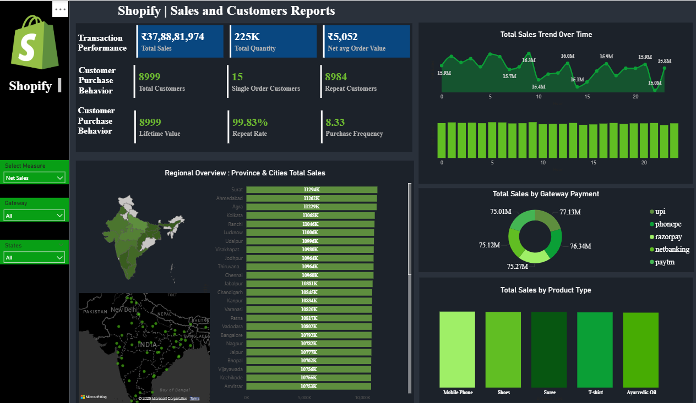

# 🛒 Shopify Sales Analysis

This project analyzes Shopify sales data using SQL and Power BI to uncover key business insights and performance metrics.

---

## 📁 Files Included

- `Shopify.sql`: Contains SQL scripts for:
  - Creating the `shopify` table
  - Creating views for business KPIs like revenue, order value, customer behavior, retention metrics, etc.
  - Updating city and state details for geographic segmentation

- `Shopify.pbix`: A Power BI dashboard built on the same data to visualize:
  - Sales performance
  - Repeat customer trends
  - Revenue and quantity metrics
  - Retention and frequency KPIs

---

## 📊 Key Metrics Covered

### 🧾 Transaction Performance
- **Net Sales** (before tax)
- **Total Quantity Sold**
- **Net Average Order Value**

### 👥 Customer Behavior
- **Total Unique Customers**
- **Single Order vs Repeat Customers**

### 🔁 Retention & Value KPIs
- **Lifetime Value (LTV)**
- **Purchase Frequency**
- **Repeat Rate (%)**

---

## 🧰 Tools & Technologies

- **SQL** (for ETL and KPI generation)
- **Power BI** (for interactive data visualization)
- **Git & GitHub** (for version control)

---

## 📌 Usage

To explore or replicate the analysis:
1. Run the SQL file (`Shopify.sql`) in your preferred SQL environment.
2. Load the Power BI file (`Shopify.pbix`) and connect to the processed dataset.
3. Customize visuals and metrics as needed.

---

## 🙌 Author

**Vaibhav Karale**  
📫 [GitHub Profile](https://github.com/VAIBHAVKARALE1011)

---

## 📃 License

This project is open-source and available under the MIT License.

## 📊 Power BI Dashboard Preview

